# 八股面经

## MySQL

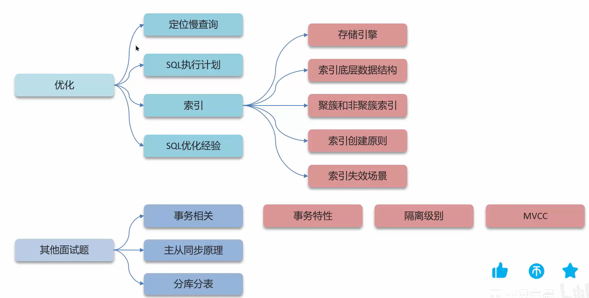

### 存储引擎

#### Mysql体系结构图

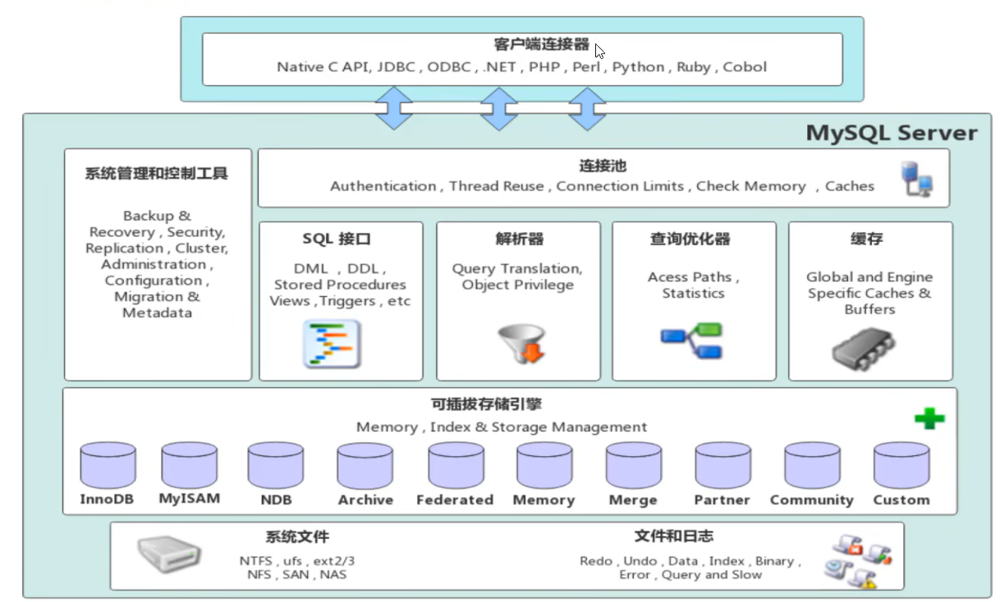

+ 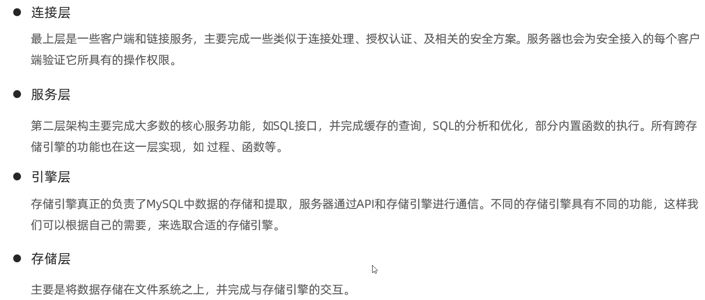

#### 存储引擎

+ 具体执行数据存储，建立**索引**，更新/查询数据的实现。其作用目标是表而非库，故每个表都有自己对应的存储引擎，不同存储引擎索引结构不同。默认是InnoDB
+ 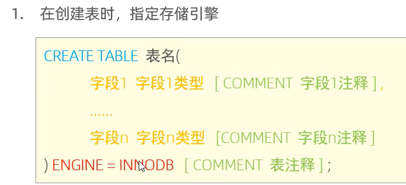
+ show engines 查询支持的存储引擎

#### InnoDB

+ 
+ 
+ 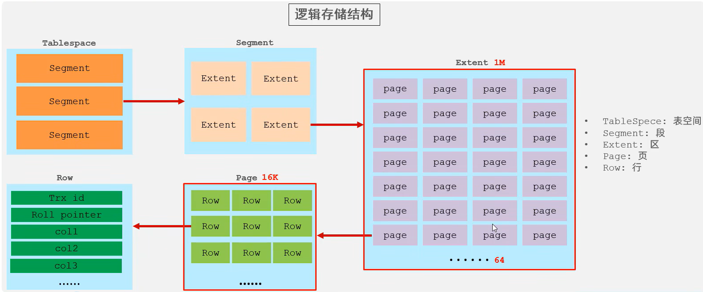

#### MyISAM

+ 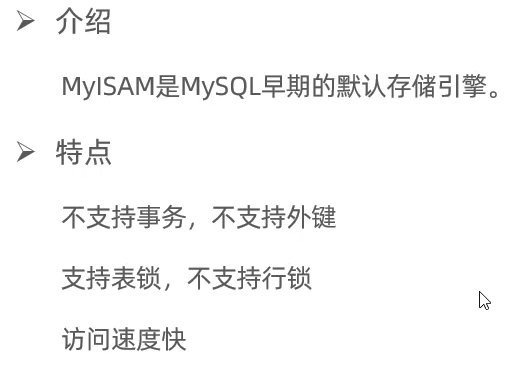
+ 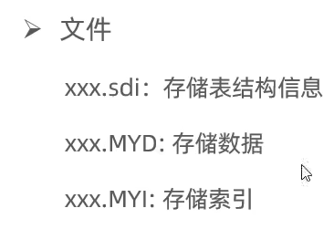

#### Memory

+ 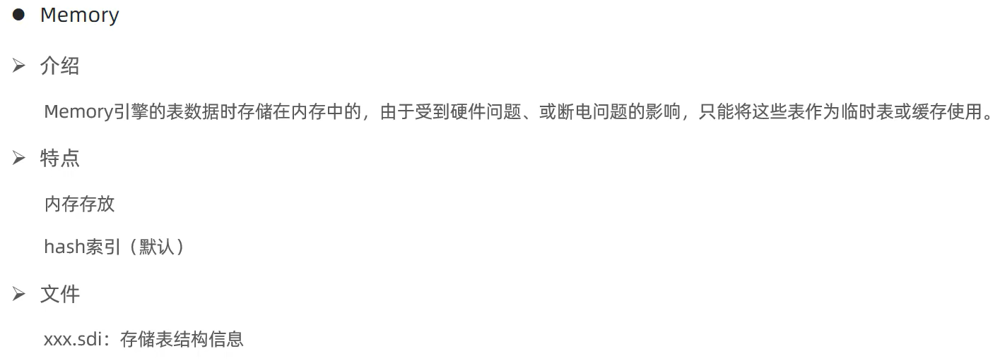

#### 引擎对比

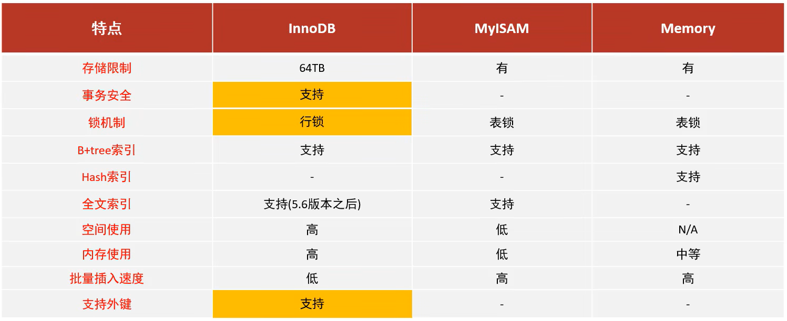

+ 引擎选择
  + 事务**完整性**和并发**一致性**要求高的，选择InnoDB
  + 读取插入为主，很少更新删除，非核心数据。选择MyISAM（MongoDB）
  + 要求高速访问，选择memory。表容量受限（Redis）

### 索引

> 索引（index）是帮助 MySQL **高效获取数据**的数据结构（有序）。在数据之外，数据库系统还维护着满足特定查找算法的**数据结构（B+树）**，这些数据结构以某种方式**引用（指向）数据**，这样就可以在这些数据结构上实现高级查找算法，这种数据结构就是索引。

+ 优缺点：
  + 优点：查询操作速度快，降低IO成本；通过索引列进行排序，降低数据排序的成本，降低CPU消耗
  + 缺点：额外占用磁盘空间，降低更新表的速度。
+ 按照**数据结构**分类有以下几种索引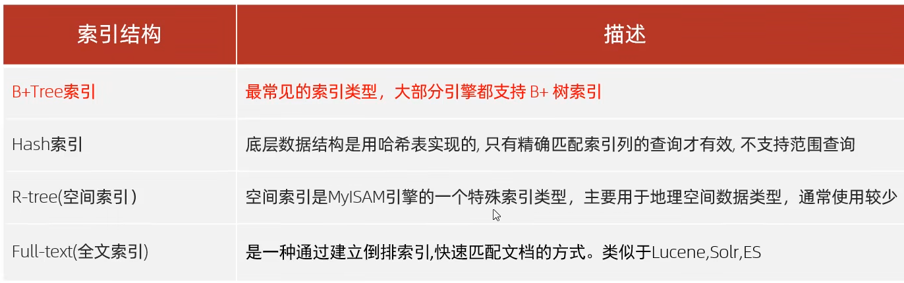
+ 只有Memory支持Hash索引，R-tree空间索引只有MyISAM支持
+ 未明确的情况下，一般索引都是B+树索引

#### 索引结构对比

+ 二叉搜索树：平衡不稳定导致的时间不稳定，层级深，检索速度就慢
  
+ 红黑树
  + 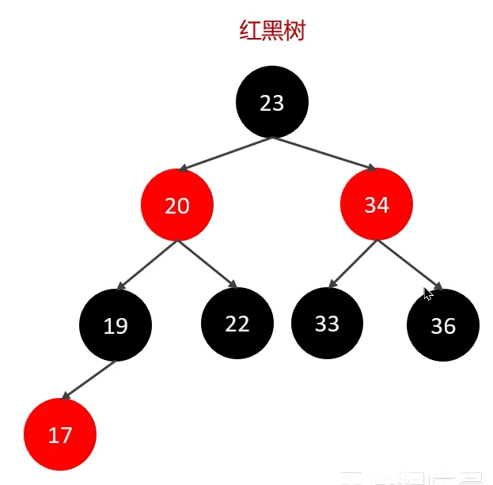
  
  + > 红黑树是一种**<u>自平衡</u>**的二叉搜索树。每个节点额外存储了一个 color 字段 ("RED" or "BLACK")，用于确保树在插入和删除时保持平衡。
  
  + 如果数据量巨大的，层级深则时间复杂度依旧很高
  
  + 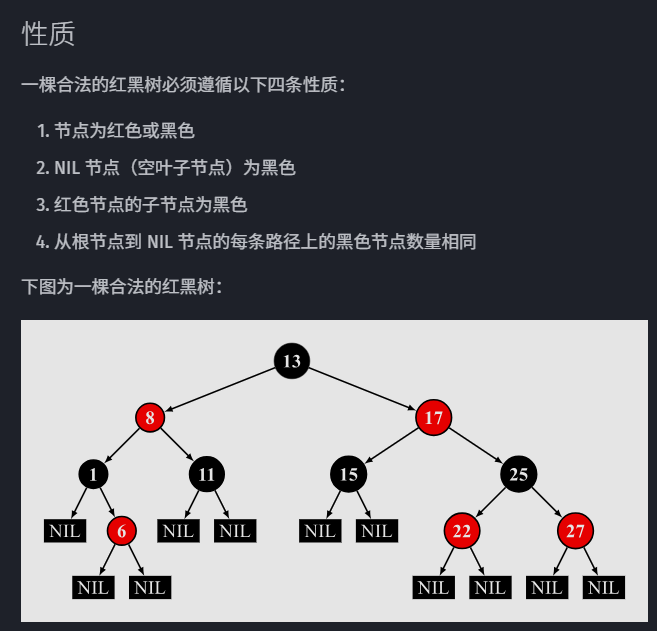
  
+ B树
  + 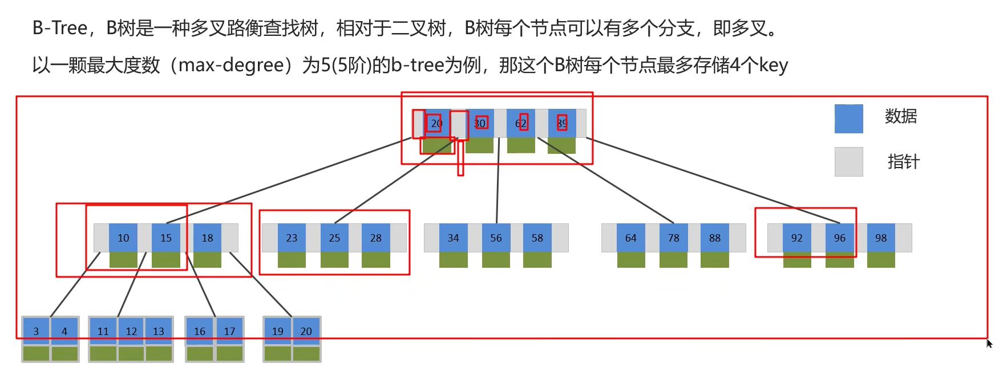
  + B树向上生长。如果一个地方插入了key+1个数据，那么中间那个key会被拿出来放到上一层。其两侧的数据则分成两半挂在两侧。
  

**B+树索引**

  + 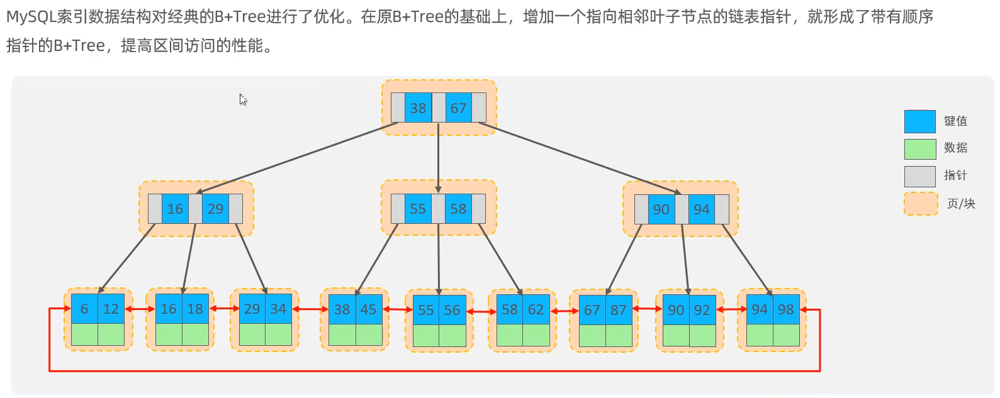
  + 非叶子节点不存储数据，哪怕是分支节点上的key也会出现在叶子节点上。
  + 叶子节点之间会连成双向链表
  
+ B树与B+树对比：
  + 磁盘读写代价B+树更低：B树需要将分支节点上的data也读入，B+树分支节点无data查询效率更高；此外B+树只需要存储key的树，没有data所以存储压力更低
  + 查询效率B+树更加稳定：因为数据全部在叶子节点，所以查找路径长度差不多
  + B+树便于扫库和区间查询：叶子节点连成双向链表，只要找到了其中一个节点就可以通过链表进行区间查询
  
+ 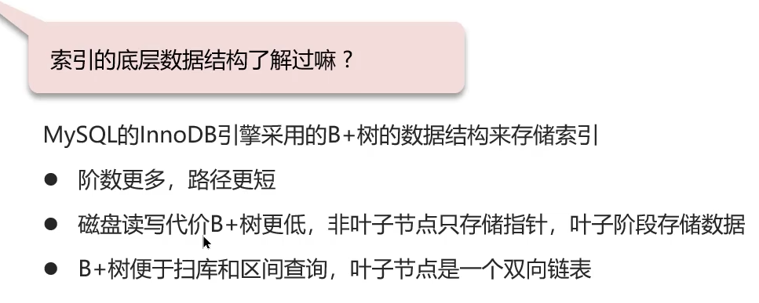

**哈希索引**

+ 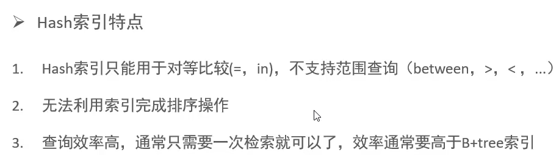
+ 

#### 索引分类

+ 按照**字段特性**分类有以下几种索引
  + 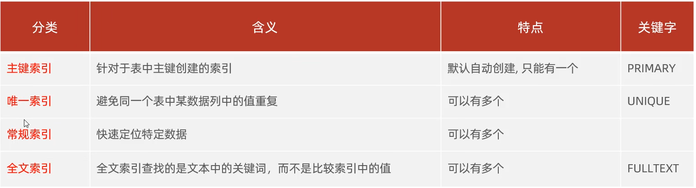

+ 在InnoDB下按照索引的**物理存储**又可以分为**聚集索引与非聚集索引**
  + 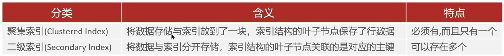
  + 
  + 举例：
    + 数据表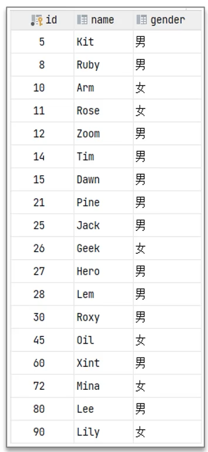
    + 聚簇索引：叶子节点存储整行记录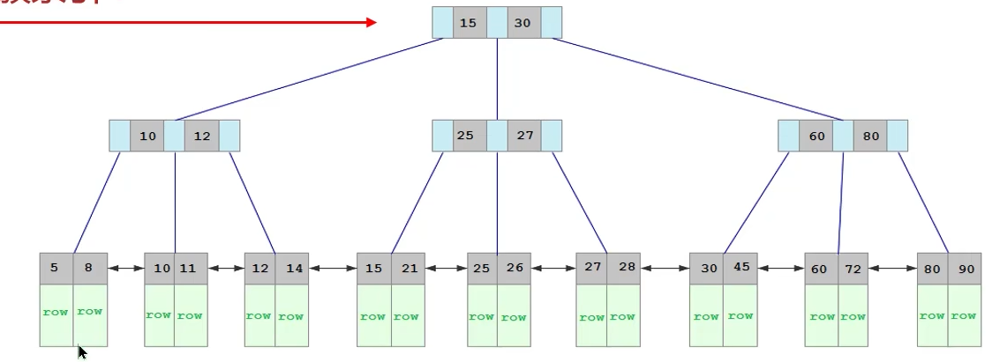
    + 二级索引：对name建立索引，叶子节点存储主键值，key都是name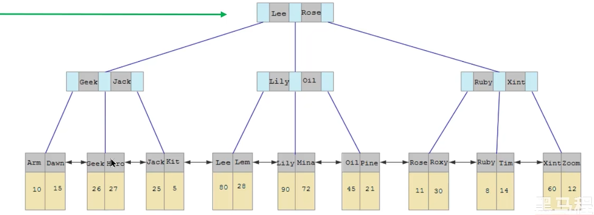
    + 对于非唯一的二级索引，有可能存在叶子节点处key相同的情况。所有通过一个key找数据有可能会找到多个id。
  + 回表查询
    + select * from table where name="Lee"
    + 通过二级索引的key来查询某一条数据，于是先通过二级索引找到主键值。再通过主键值在聚集索引找到行
+ 根据索引**关联的字段数**可以分为**单列索引、联合索引**

#### 索引操作语法

+ 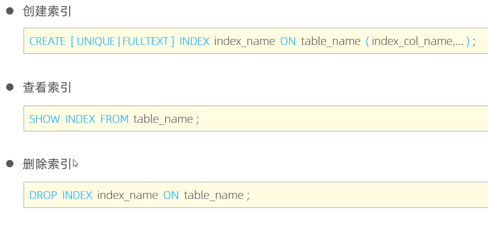

#### 索引性能分析

+ SQL执行频率
+ 定位**慢查询**
  + 方案一：开源工具
    + 调试工具：Arthas
    + 运维工具：Prometheus，Skywalking
  + 方案二：MySQL自带慢日志
    + 慢查询日志记录了所有执行时间超过指定参数（long_query_time，单位：秒，默认10秒）的所有SQL语句的日志。如果开启慢查询日志，需要在MySQL的配置文件my.conf中配置如下信息：
    + 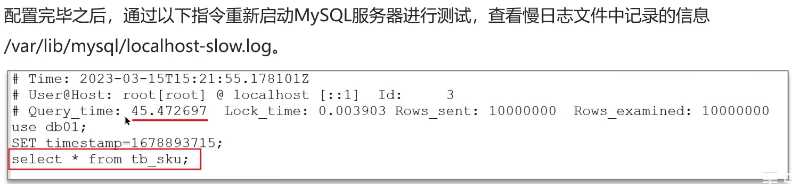
+ 具体SQL性能分析
  + profile详情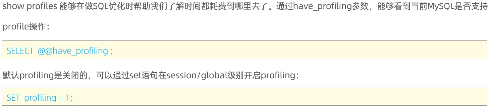
  + 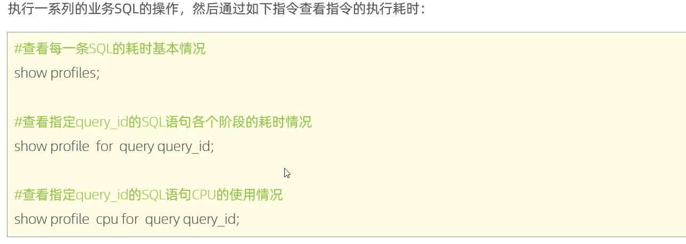
+ 查看执行计划
  + 可以采用EXPLAIN或者DESC命令获取MySQL如何执行SELECT语句的信息
  + 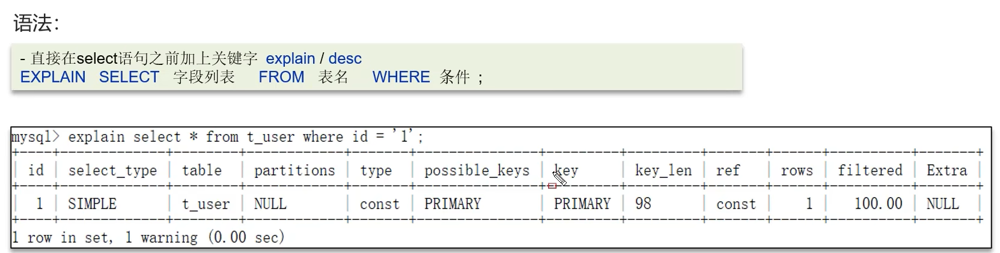
  + Explain执行计划各字段含义：
    + Id：Select查询的序列号，表示查询中执行select子句或者操作表的顺序（**id相同**则执行顺序从上到下；**id不同**，值越大，越先执行）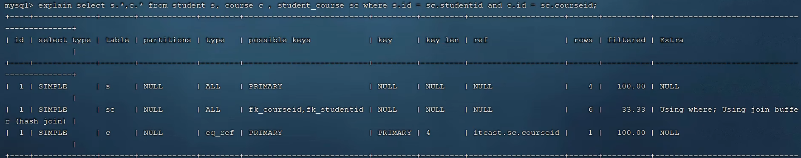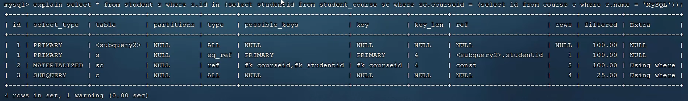

    + select_type：

    + type：这条sql的连接类型，性能由好到差从上向下
      + NULL：略
      + system：查询系统中的表
      + const：根据**单表查询**中，主键索引查询或唯一索引查询
      + eq_ref：**关联查询**中主键索引查询或唯一索引查询，一般返回一条数据
      + ref：非唯一性索引查询，可能返回多条数据，比如根据地域查询
      + range：范围查询
      + index（**需要优化**）：全索引查询，扫描索引树
      + all（**需要优化**）：无索引，全盘扫描

    + 其他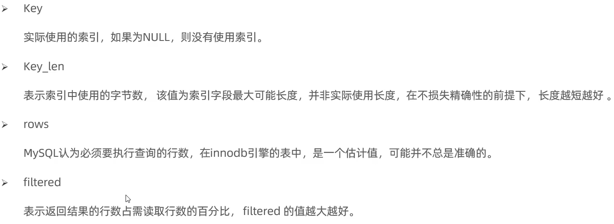

    + 需要重点关注type，possible_keys,key,key_len

  + 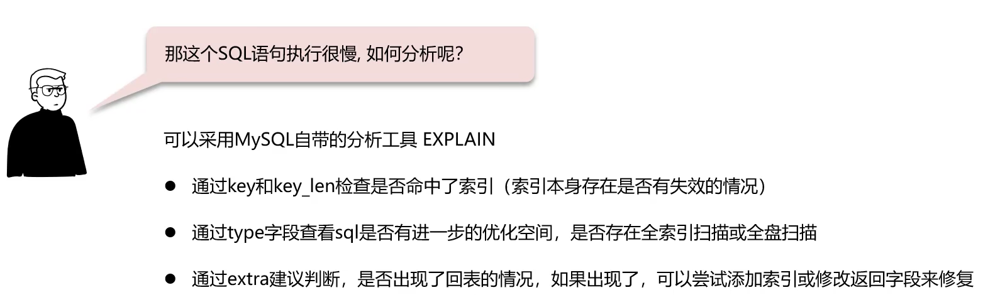
+ 慢sql种类

#### 索引使用原则

+ **最左前缀法则**：如果索引了多列（联合索引），要遵循查询的时候从索引的最左列开始，并且不跳过索引中的列。如果跳过某一列则会出现部分失效。假如索引为（name,status,address)
  
  1. 索引生效，符合最左前缀法则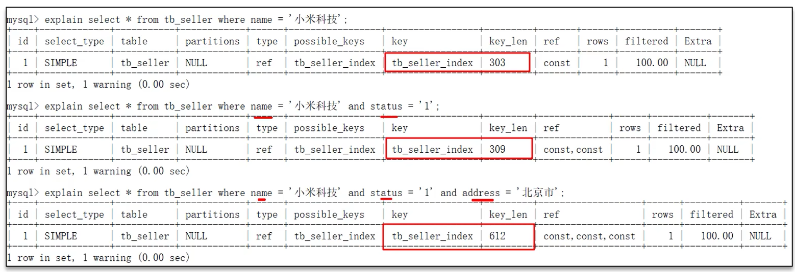
  2. 索引失效，违法最左前缀法则，key和key_len=NULL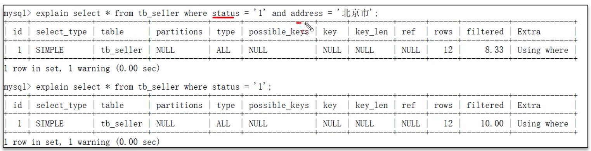
  3. 如果符合最左前缀，跳过中间的某一列，则只有左边满足法则的列生效，即只有name生效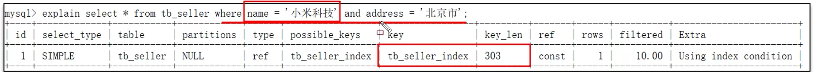
  
+ **范围查询**：（联合索引中）出现范围查询大于，小于，范围查询右侧的列索引失效
  1. name和status走的索引，address没有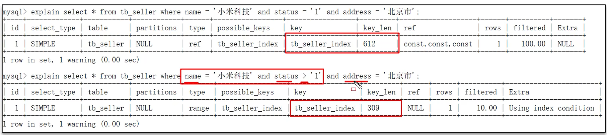
  1. 在业务允许的情况下，使用大于等于和小于等于能避免索引失效的情况

+ **运算操作**：（联合索引中）不要在索引列上进行运算操作，该索引及其右边索引也会失效
  
  1. 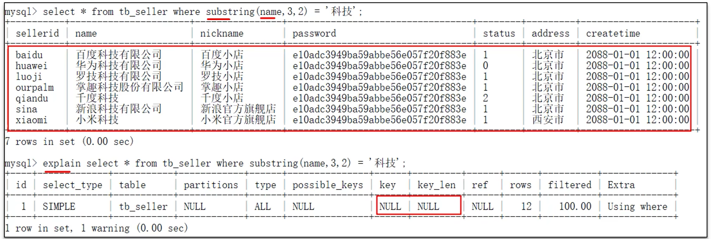
  
  + **字符串加单引号**：字符串要加单引号，否则会造成该索引及其右边索引失效。
  
     1. 类型转换导致失效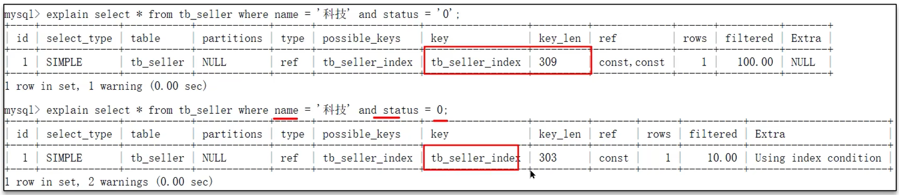
  + **开头模糊查询**：不要以%开头的Like模糊查询，否则索引失效。如果仅仅是尾部模糊匹配，索引不会失效。如果是头部则会失效
  
     1. 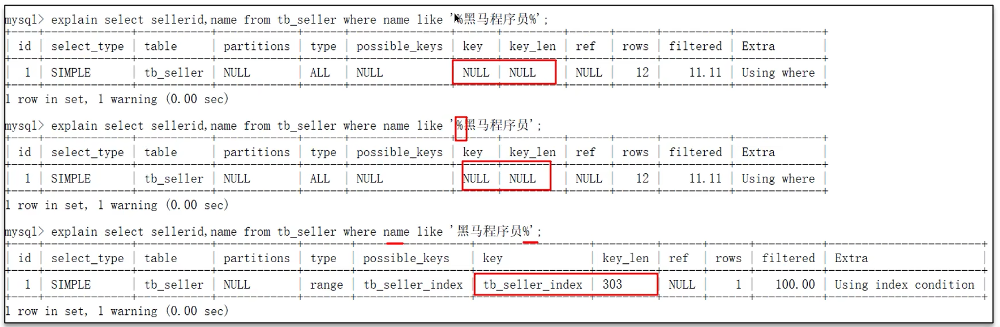
  + **or连接的条件**：用or分割开的条件，如果or前的条件中的列有索引，而后面的列中没有索引，那么涉及的索引都不会被用到
  
     1. 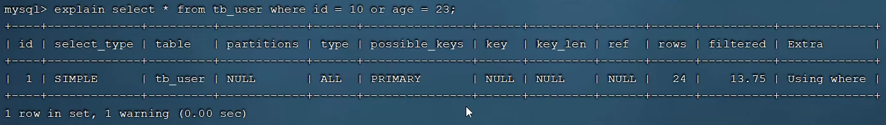
  + **数据分布影响**：如果MySQL评估使用索引比全表还慢，则不会使用索引
  
     1. 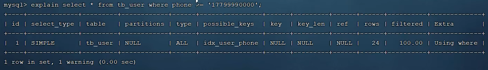
     2. 是否会走索引不是固定，而是根据索引命中的数据个数在整张表中的占比。条件中的索引项命中的数据占少数，就会走索引
  + **SQL提示**：是优化数据库的一个重要手段，简单来说就是在SQL语句中加入一些人为的提示来达到优化操作的目的
  
     1. 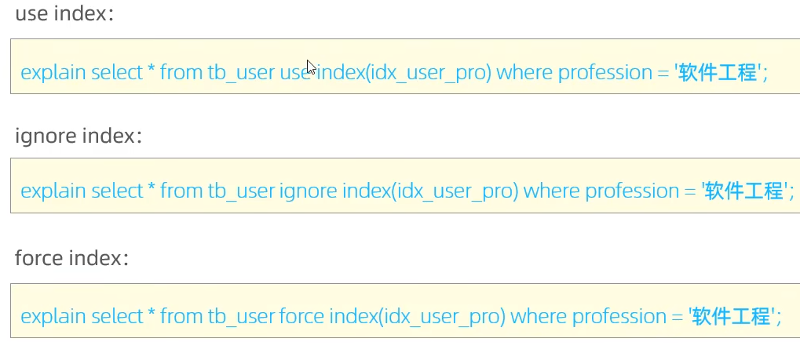
     2. 不使用SQL提示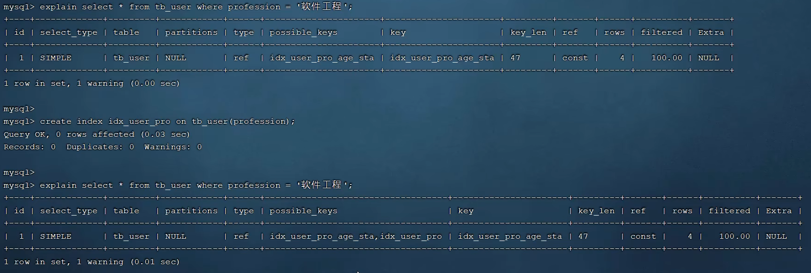
     3. 使用SQL提示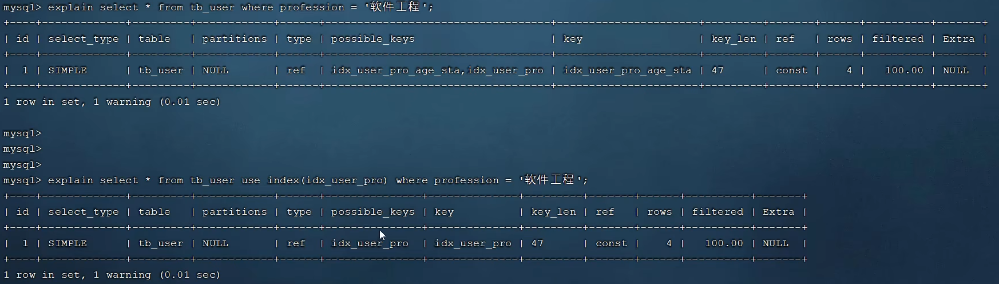
  + **覆盖索引**：覆盖索引是指查询使用了索引，并且需要返回的列在该索引中已经全部能找到
     1. 以上图举例：
        + 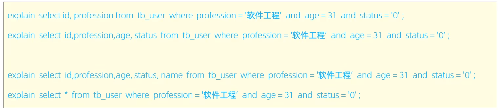
        + 只要是按照索引（不论是聚集还是非聚集）查的，并且不需要回表查就都算是覆盖索引
     2. 覆盖索引体现在extra中
     3. 超大分页处理
        + 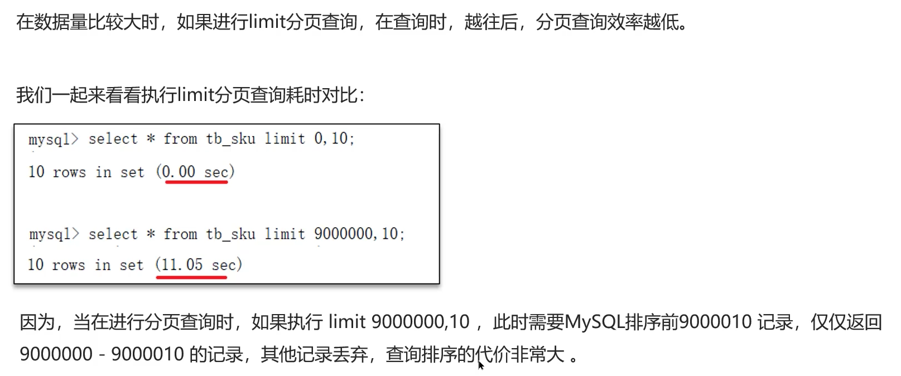
        + 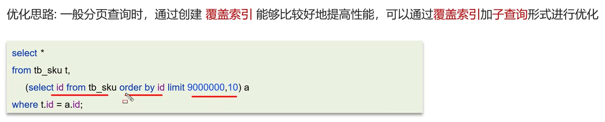
  + **前缀索引**：只讲某段长文本的一部分前缀抽取出来建立索引，这样可以大大节约索引空间，从而提高索引效率。
     1. n代表指定字符串的前多少个字符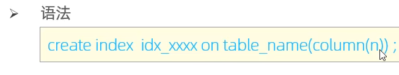
     2. 前缀长度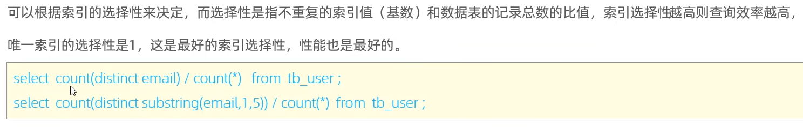
     3. 前缀索引回表查询相比别的回表查询会多几步。首先在通过二级索引找到id之后，会拿到id对应row下的索引项对应的整个信息，然后再进行一次具体的对比。之后从二级索引的叶子节点组成的链表继续往后遍历，查看是否有一样的索引项。因为前缀索引只能保证前面部分相同，并且不能保证索引项唯一。
  + **单列索引和联合索引**：如果涉及到多个条件，考虑到对查询字段建立索引的时候，优先建立联合索引。
     + 多条件联合查询时，MySQL优化器会评估那个字段的索引效率更高，会选择该索引完成本次查询
     + 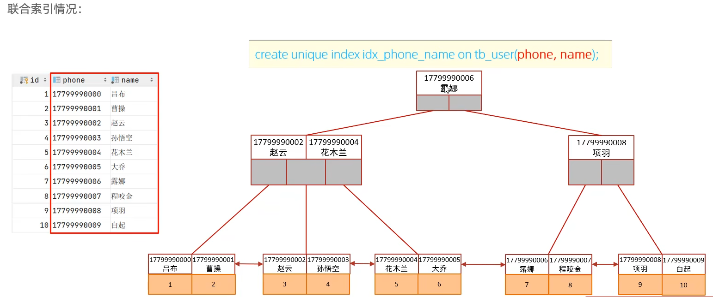

#### 索引创建原则

+ 普通索引创建原则：
  1. **（重要）**针对数据量较大，且**查询**比较频繁的表建立索引。单表超过10w数据（增加用户体验）。
  2. **（重要）**针对常作为查询条件（where）,排序（order by），分组（group by）操作的字段建立索引。
  3. 尽量选择区分度高的列作为索引，尽量建立唯一索引，区分度越高，使用索引的效率越高
  4. 如果是字符串类型的字段，字段的长度较长，可以针对于字段的特点，建立**前缀索引**。
  5. **（重要）**尽量使用联合索引，将减少单列索引，查询时，联合索引很多时候可以覆盖索引，节省存储空间，避免回表，提高查询效率。
     + 联合索引的结构：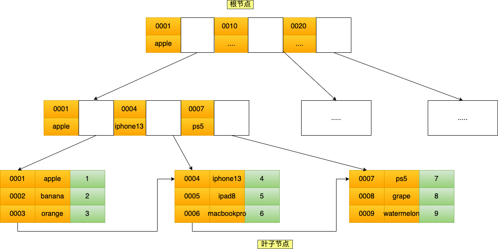
  6. **（重要）**要控制索引的数量，索引并不是多多益善，索引越多，维护索引结构的代价也就越大，会影响增删改的效率。
  7. 如果索引列不能存储NULL，在创建表时使用NOT NULL约束它。当优化器知道每列是否包含NULL值，它可以更好地确定哪个索引最有效地用于查询

### SQL优化

#### 插入数据

+ insert优化：
  + 批量插入：每次插入需要建立连接，批量插入则减少连接次数
  + 手动事务提交：减少提交次数
  + 主键顺序插入：取决于数据组织结构
+ 大批量插入数据：如果一次性需要插入大批量数据，使用insert语句插入性能较低，此时可以使用MySQL数据库提供的load指令进行插入。(同样建议主键顺序插入)
  + 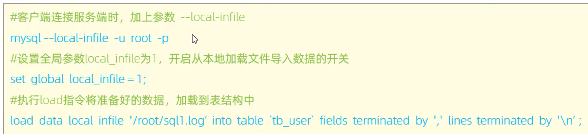
  + 

#### 主键优化

+ 在innoDB存储引擎中，表数据都是根据主键顺序组织存放的，这种存储方式的表称为索引组织表
+ 叶子节点和非叶子节点都是存储在一个page当中（黄色）
+ 一个Extent是1M,一个page是16k。所以一个Extent中有64个page。Page中的存放的都是行数据，有的一行是索引，有的一行是数据内容。
+ 插入数据的情况
  1. 顺序插入的情况下，page按序申请，插入。
  2. 乱序插入的情况下会出现**页分裂**，对性能损耗大
     + 将50插入的时候会发现空间不够，此时会申请一个新page
     + 然后将要插入的位置所在page中50%左右的内容移到新的page上，然后将50插入到新的page中
     + 最后，重新设置链表指针
  3. **页合并**：
     + innodb中删除一行数据并不会直接物理删除，而是仅做标记（flaged）。
     + 当页中删除的记录达到MERGE_THRESHOLD（默认为页的50%），InnoDB就会开始找最近的页查看是否可以做合并以优化空间操作

#### 主键设计原则

+ 满足业务需求的情况下，尽量降低主键的长度。能减少二级索引的叶子大小，从而降低磁盘开销以及减低检索时的IO
+ 插入数据时，尽量顺序插入，选择AUTO_INCREMENT自增
+ 尽量不要使用UUID做主键或者其他自然主键，如身份证号。因为生成的UUID无序，容易造成乱序插入
+ 尽量避免对主键的修改

#### order by优化

1. Using filesort:通过表的索引或全表扫描，读取满足条件的数据行，然后再排序缓冲区sort buffer中完成排序操作，所有不是通过索引直接返回排序结果的排序都是FileSort。
2. Using index:通过有序索引顺序扫描直接返回有序数据，这种叫using index，不需要额外排序，操作效率高。

+ 多字段排序的时候也遵循最左前缀法则。
+ 如果说联合索引都是升序，那么在进行一个升序排序一个后序排序的时候，就会出现filesort。此时可以争对不同的顺序再建立一个索引。Collation表示的就是索引排序方向
+ 注意，以上前提是用的覆盖索引。回表查询都是filesort
+ 如果不可避免的出现filesort，大数据量排序时，可以适当增大排序缓冲区大小sort_buffer_size（默认256k)

#### group by 优化

+ 在分组操作时，可以通过索引来提高效率
+ 分组操作时，索引的使用也是满足最左前缀法则。其中index(A,B).`where A in (1) group by B`也是属于满足最左前缀法则

#### limit优化

+ 
+ 优化思路：一般分页查询时，通过创建覆盖索引能够比较好地提高性能，可以通过覆盖加子查询形式进行优化。
+ 

#### count优化

+ MyISAM引擎把一个表的总行数存在了磁盘上，因此count(*)的时候会直接返回这个数，效率很高
+ InnoDB引擎就麻烦了，它执行count(*)的时候，需要把数据一行一行地从引擎里面读出来，然后累计计数
+ 优化思路：自己计数
+ count的几种用法
  + count()是一个聚合函数，对于返回的结果集，一行行判断，如果count函数返回的参数不是NULL，累计值就加1，否则不加，最后返回累计值
  + 
  + 

#### update优化

+ InnoDB的行锁是针对索引加到锁，不是针对记录加的锁，并且该索引不能失效，否则会从行锁升级为表锁。
+ 如前者就是行锁，后者就是表锁

### 视图

> 视图（View）是一种虚拟存在的表。视图中的数据并不在数据库中实际存在，行和列数据来自自定义视图的查询中使用的表，并且是在使用视图时动态生成的。
>
> 通俗的将，视图只保存了查询的SQL逻辑，不保存查询结果。所以我们在创建视图的时候，主要工作就落在创建这条SQL查询语句上。

#### 操作语法

+ 创建`CREATE [OR REPLACE] VIEW 视图名称[(列名列表)] AS SELECT语句[WITH [CASCADED|LOCAL] CHECK OPTION]`
+ 查询视图
+ 修改视图:与创建语句相同，但是修改视图主要是OR REPLACE这个命令，创建视图则可以不加
+ 删除视图

#### 视图检查选项

+ 当使用`WITH CHECK OPTION`子句创建视图时，MySQL会通过视图检查正在更改的每个行，例如插入，更新，删除，以使其符合**视图的创建时候的条件**
+ MySQL允许基于另一个视图创建视图，它还会检查其所**依赖的所有视图**中的规则是否依旧符合。为了确定检查的范围，mysql提供了两个选项：CASCADED和LOCAL，默认值为CASCADED。依赖视图创建视图，哪怕没有加检查选项，都会递归到依赖的视图做判断。如果以来的视图都没说检查则都不会检查，如果说了检查local则会检查当前视图。如果某个说了cascaded，那么其所依赖的各层视图都会默认需要检查
  + V2加了CASCADED之后，V1也相当于加了CASCADED check option，涉及修改操作的时候都会做检查。但是V3没加，那么V3本身不会触发检查，但是会触发V2的检查。
  + v3做修改操作的时候，会递归v2，v2添加了检查则会检查，然后递归v1，v1没说检查，v2也没说级联检查，则v1不会做检查

#### 视图更新条件

+ 
+ 作用：
  + **简单：**视图可以简化用户对于数据的理解（视图定义切中有效数据），也可以简化他们的操作（不需要每次都做限制条件，视图自带限制条件），那些经常使用的查询可以被定义为视图，从而使得用户不必未以后的操作每次指定全部的条件。
  + **安全：**数据库可以授权查看与修改范围，但是只能争对表单位，对于行列单位无法限制。通过视图的授权则可以实现。
  + **数据独立：**试图可以帮助用户屏蔽真实表结构变化带来的影响。比如说数据来源的基表发生了变化，但是争对视图的查看不变，实现了解耦。

### 存储过程

>存储过程是事先经过编译并存储在数据库中的一段 **SQL 语句的集合**，调用存储过程可以简化应用开发人员的很多工作，减少数据在数据库和应用服务器之间的传输，对于提高数据处理的效率是有好处的。
>
>存储过程思想上很简单，就是数据库 SQL 语言层面的代码**封装与重用**。


**特点**

+ 封装，复用
+ 可以**接收参数**，也可以**返回数据**
+ 减少网络交互，效率提升

#### 基本语法

+ 创建
+ 调用
+ 查看
+ 删除

#### 变量

+ 系统变量：
  + 查看系统变量
  + 设置系统变量
+ 用户自定义变量：初始值是NULL
  + 赋值：
  + 使用：
  + 示例：
+ 局部变量
  + 声明:变量类型就是数据库字段类型：INT,BIGINT,CHAR,VARCHAR,DATE,TIME等
  + 赋值：
  + 示例：

#### if

+ 语法：
+ 示例：

#### 参数


+ 用法：
+ 示例：

#### case

+ 语法：
  + 
  + 
+ 示例：

#### 循环结构

+ while：while结构是有条件的循环控制语句。满足条件后，再**执行循环**体中的SQL语句
  + 语法：
+ repeat：repeat是有条件的循环控制语句，当满足条件的时候**退出循环**
  + 语法：
+ loop：LOOP实现简单的循环，如果不在SQL逻辑中增加退出循环的条件，可以用来实现简单的死循环。LOOP可以配合以下两个语句使用：
  + LEAVE：配合循环使用，退出循环
  + ITERNATE：必须用在循环中，作用是跳过当前循环剩下的语句，直接进入下一次循环
  + 语法：
    + 
    + 
  + 示例：

#### 游标

+ 游标（CURSOR）是用来存储查询结果集的数据类型，在存储过程和函数中可以使用游标对结果集进行循环的处理。游标的使用包括游标的声明、OPEN开启、FETCH获取 和 CLOSE关闭
+ 语法：
  + 声明游标
  + 打开游标
  + 获取游标记录
  + 关闭游标
+ 示例：
+ 注意:普通变量的声明应该在声明游标之前！

#### 条件处理程序：Handler

+ 
+ 语法：有点像全局异常处理器
+ 示例：

### 存储函数

> 存储函数shi'you是有返回值的存储过程，存储函数的参数只能是IN类型的

+ 语法
+ 示例

### 触发器

> 触发器是与表有关的**数据库对象**，指在 `INSERT`、`UPDATE`、`DELETE` 之前或之后，触发并执行触发器中定义的 SQL 语句集合。  触发器的这种特性可以协助应用在数据库层面确保数据的**完整性**、**日志记录**、**数据校验**等操作。
>
> 使用别名 `OLD` 和 `NEW` 来引用触发器中发生变化的记录内容，这与其它数据库是相似的。  
> 目前触发器还只支持**行级触发**，不支持**语句级触发**。
>
> 行级的意思是，一条SQL影响了5行，那么会触发5次


#### 基础语法

+ 创建触发器
+ 查看
+ 删除
+ 示例

### 锁

>锁是计算机协调多个进程或线程并发访问某一资源的机制。在数据库中，除传统的计算资源（CPU、RAM、I/O）的争用以外，数据也是一种供许多用户共享的资源。如何保证数据并发访问的**一致性**、**有效性**是所有数据库必须解决的一个问题，锁冲突也是影响数据库并发访问性能的一个重要因素。从这个角度来说，锁对数据库而言显得尤其重要，也更加复杂。

**MySQL中，按照锁的粒度分，分为以下三类：**

1. 全局锁：锁定数据库中的所有表。
2. 表级锁：每次操作所住整张表。
3. 行级锁：每次操作锁住对应的行数据。

#### 全局锁

> 全局锁是对整个数据库实例加锁，加锁后整个实例就处于只读状态，后续的DML的**写语句**，**DDL语句**，以及更新操作的**事务提交语句**都将被阻塞。
>
> 其典型的使用场景是做全库的逻辑备份，对所有的表进行锁定，从而获取一致性视图，保证数据的完整性。

+ 语法
  + 加锁
  + 解锁
+ 特点
  + 如果在主库上备份加全局锁，那么备份期间都不能执行更新，业务基本就得停摆
  + 如果在从库上备份，那么在备份期间，从库不能执行主库同步过来的二进制日志(binlog)，会导致主从延迟。
+ 

#### 表级锁

> 表级锁，每次所著整张表。锁定力度大，发生锁冲突的概率最高，并发度最低。应用在MyISAM,InnoDB,BDB等存储引擎中。

+ 分类
  + 表锁
  + 元数据锁（meta data lock,MDL)
  + 意向锁
+ 表锁(手动添加释放)
  + 分类：
    1. 表共享读锁（read lock）
    2. 表独占写锁（write lock）
  + 语法：
+ **元数据锁：避免数据操作和表结构操作之间的冲突逻辑。元数据锁几乎会与其他的所有锁伴生**
  + 加锁过程系统自动控制，无需显式使用，在访问一张表的时候会自动加上。MDL锁主要作用是维护表**元数据**的数据**一致性**，在表上有活动事务的时候，不可以对元数据进行写入操作。（可以简单理解元数据为表结构，维护表结构的数据一致性。如果某一张表存在未提交的事务，那么不能去修改这张表的表结构）<u>为了避免DML与DDL语句冲突，保证读写的正确性</u>（也就是数据**增删改查**和**表结构**更改之间的隔离）
  + 
  + SHARED_READ和SHARED_WRITE都是读锁（共享锁），互相兼容。仅仅是排他锁与共享锁，以及排他锁之间互斥。另外元数据锁与表锁平行不互斥。
  + 
+ **意向锁:解决行锁与表锁之间的冲突逻辑**
  + （如果加行锁之后别的线程想要加表锁，就要事先一行行确认一下是否有行锁，否则会冲突。于是表锁的性能低。为了解决这个问题，意向锁就应运而生。）为了避免DML在执行时，加的行锁与表锁冲突，InnoDB引入了意向锁，使得表锁不用检查每行数据是否加锁，使用意向锁来减少表锁的检查。事务提交时候，意向锁自动释放。
  + 分类：
    + 意向共享锁（IS）：由语句`select ... lock in share mode`添加
    + 意向排他锁（IX）：由`insert,update,delete,select ... for update`添加
  + 兼容情况：
    + 意向共享锁（IS）：与表锁共享锁（read）兼容，与表锁排他锁（write）互斥
    + 意向排他锁（IX）：与表锁共享锁（read）及表锁排他锁（write）都互斥。意向锁之间不会互斥
  + 

#### 行级锁

> 行级锁，每次操作锁住对应的行数据。锁定粒度最小，发生锁冲突的概率最低，并发度最高。应用于InnoDB存储引擎中。
>
> InnoDB的数据式基于索引组织的，行锁是通过对索引上的**索引项加锁**来实现的，而不是对记录加的锁。
>
> 事务提交后自动释放

+ 分类
  + 行锁（Record Lock）：锁定单个行记录的锁，防止其他事务对此进行update和delete。在读已提交和可重复读隔离级别下都支持。
  + 间隙锁（Gap Lock）：锁定索引记录间隙（不含该记录），确保索引记录间隙不变，防止其他事务在这个间隙进行insert，产生幻读。在可重复读隔离级别下都支持。
  + 临键锁（Next-key Lock）：行锁与间隙锁的组合，同时锁住数据和上侧Gap。在可重复读的隔离级别下支持。
+ 行锁：
  + 分类
  + 
  + 
  + 
+ 间隙锁/临键锁：间隙锁的唯一目的是防止其他事务在索引记录的**间隙**中插入数据。间隙锁可以**共存**，一个事务采用的间隙锁不会阻止另一个事务在同一间隙上采用间隙锁。
  + 
  + 上述第二条的解释：如果是一个普通索引的话，或许不满足值唯一。为了RR的隔离级别，我们不仅会对**满足条件的行加行锁**，对第一行及上侧间隙加临键锁，还会对最后最后一行下侧的gap加间隙锁。
  + 第三条的解释：比如说两条记录，19，25；然后对>=19进行update。那么会对19本身加锁。（19，25]加临键锁，对（25，正无穷]加临键锁

## InnoDB引擎

### 逻辑存储结构


### 架构

+ 架构图

#### 内存结构

+ 

+ Buffer Pool：

  + > 缓冲池是主内存中的一个区域，里面可以缓存磁盘上经常操作的真实数据，再执行增删改查操作时，先操作缓冲池中的数据（若缓冲池没有数据，则从磁盘加载并缓存），然后再以一定频率刷新到磁盘，从而减少磁盘IO，加快处理速度

  + 缓冲池以page页为单位，底层采用链表数据结构管理page。根据状态，将page分为三种类型

    + free page:空闲
    + clean page:被使用但是数据没有被修改
    + dirty page:被使用，也被修改，数据与磁盘不一致

+ Change Buffer:

  + > 更改缓冲区（争对非唯一二级索引页），在执行DML语句是，如果这些数据Page没有在Buffer Pool中，不会直接操作磁盘，而会将<u>数据变更操作</u>存在更改缓冲区Change Buffer中，在未来数据被读取时，再将数据合并恢复到Buffer Pool中，再将合并后的数据刷新到磁盘

  + 二级索引通常是非唯一的，并且以相对随机的顺序插入二级索引。同样删除和更改可能会影响索引树中不相邻的二级索引页，如果每一次都操作磁盘，会造成大量的磁盘IO。有了ChangeBuffer之后，我们可以在缓冲池中进行合并处理，减少磁盘IO。

+ Adaptive Hash Index：

  + > 自适应hash索引，用于优化对Buffer Pool数据的查询。InnoDB存储引擎会监控对表上个索引页的查询，如果观察到hash索引可以提升速度，则建立hash索引，称之为自适应hash索引。自适应哈希索引无需人工干预由系统根据情况自动完成

+ Log Buffer：

  + > 日志缓冲区，用来保存要写入到磁盘中的log日志数据（redo log，undo log），默认大小为16MB，日志缓冲区的日志会定期刷新到磁盘中。如果需要更新，插入或删除许多行的事务，增加日志缓冲区的大小可以节省磁盘I/O


#### 磁盘结构


+ 
+ 
+ 
+ 
+ 
+ DoubleWrite Buffer Files:双写缓冲区，innoDB引擎将数据页从Buffer Pool刷新到磁盘前，先将数据页写入双写缓冲区文件中，便于系统异常时恢复数据。
+ 


#### 后台线程


> 后台线程负责将内存数据同步到磁盘。


### 事务原理

> 事务是一组操作的集合，它是一个不可分割的工作单位，事务会把所有的操作作为一个整体一起向系统提交或撤销操作请求，即这些操作要么同时成功，要么同时失败

+ 事务开启与关闭：
  1. 通过开关自动提交@@autocommit来控制，commit手动提交，rollback回滚
  2. 过开启事务START TRANSACTION 或BEGIN，同样是commit,rollback
+ 查看/设置事务提交方式

#### 事务特性

+ 
+ **四种机制的底层原理**

#### redo log

+ 
+ 
+ 提交后，首先会将redo log提前写入磁盘，之后再将脏页中的内容写入到磁盘中去。这样当写入磁盘过程中出现错误就可以利用redo log恢复（redo log上记录的是事务做的物理修改内容。我们将redo log写入之后，在刷盘过程中宕机。此时磁盘中的数据不完整。内存被清空。于是我们把redo log读到内存中，然后根据redo log上的指令逐条读取磁盘，然后做修改，再存入）。
+ 此外，先写日志能过够保证I/O开销减小（如果没有WAL还进行批处理的话，宕机后会出现日志丢失，数据丢失无法恢复。所以如果没有WAL就必须放弃批处理，只能提交一条写一条，关键是随机读写，才能保证其永久性。而有了WAL，能保证日志完整，于是就可以进行批处理，刷盘的时候可以顺序IO，一口气进行，所以速度很快。）
+ 磁盘中redo log循环写，并不会永久保存

#### undo log


### MVCC

#### 基本概念

+ 当前读：读取的是记录的最新版本，读取时还要保证其他并发事务不能修改当前记录，会对读的记录进行加锁。对于我们日常的操作，如：`select...lock in share mode`(共享锁)，`select...for update、update、insert、delete`(排他锁)都是一种当前读。
+ 快照读：简单的select（不加锁）就是快照读，快照读，读取的是记录数据的可见版本，有可能是历史数据，不加锁，是非阻塞读。
  + Read Committed:每次select，都生成一个快照读。
  + Repeatable Read:开启事务后第一个select语句才是快照读的地方。（事务内第一个 select 生成快照，后面都用它）
  + Serializable：快照读会退化为当前读。

> MVCC：全称 Multi-Version Concurrency Control，多版本并发控制。指维护一个数据的多个版本，使得读写操作没有冲突，**快照读**为 MySQL 实现 MVCC 提供了一个非阻塞读功能。  
>
> MVCC 的具体实现，还需要依赖于数据库记录的**三个隐式字段**、**undo log 日志**和 **read view**。

#### 实现原理

+ 记录中的隐藏字段
+ undo log
  + 定义
  + undo log 版本链
    + 
    + 
    + 
+ readview
  + 定义
  + 
  + 
  + 

+ 流程：
  + RC隔离级别下的访问情况
    + 每次select都生成一个ReadView，然后访问的时候争对当前版本下的记录做匹配，看是否能访问。如果都不匹配则顺应undolog链回溯之前的版本。
    + 
    + 

  + 


#### 总结：


### MySql主从复制

> 主从复制是指将主数据库得DDL和DML操作通过二进制日志传到从库服务器中，然后从苦衷对这些日志重新执行（也叫重做），从而保持从库与主库得数据同步
>
> MySQL支持一台主库同时向多台从库进行复制，从库同时也可以作为其他从库得主库进行链状复制


> **二进制日志：**二进制日志（Binary Log）是记录数据库所有数据变更操作（如增删改）的日志文件，用于**数据复制、备份恢复和数据同步**。

#### 原理


## Java集合

**Java集合框架体系**

+ 
+ 线程安全：指添加了synchronized锁，同时性能低
+ LinkedList底层是双向链表
+ ConcurrentHashMap：线程安全的实现方式不一样

### List相关

+ 数据结构-数组

  + 
  + 

+ **ArrayList源码分析**

  + 成员变量：

    ```java
        private static final long serialVersionUID = 8683452581122892189L;
    
        private static final int DEFAULT_CAPACITY = 10;
    //初始容量
        private static final Object[] EMPTY_ELEMENTDATA = {};
        private static final Object[] DEFAULTCAPACITY_EMPTY_ELEMENTDATA = {};
        transient Object[] elementData;
        private int size;
    ```
    
  + 有参，无参，对象拷贝构造函数
  
    ```java
        public ArrayList(int initialCapacity) {
            if (initialCapacity > 0) {
                this.elementData = new Object[initialCapacity];
            } else if (initialCapacity == 0) {
                this.elementData = EMPTY_ELEMENTDATA;
            } else {
                throw new IllegalArgumentException("Illegal Capacity: "+
                                                   initialCapacity);
            }
        }
        
        public ArrayList() {
            this.elementData = DEFAULTCAPACITY_EMPTY_ELEMENTDATA;
            //默认容量 但是是空集合
        }
    
    	
    	public ArrayList(Collection<? extends E> c) {
            Object[] a = c.toArray();
            if ((size = a.length) != 0) {
                if (c.getClass() == ArrayList.class) {
                    elementData = a;
                } else {
                    elementData = Arrays.copyOf(a, size, Object[].class);
                }
            } else {
                // replace with empty array.
                elementData = EMPTY_ELEMENTDATA;
            }
        }
    //将collection队列转化为数组，然后将数组的地址赋给elementData
    	
    ```
  
  + 添加和扩容操作
  
+ ArrayList相关面试题

  + 底层用动态的数组实现
  + 初始容量为0，默认容量为10。但是要在第一次添加数据的时候，空数组才会被设置为默认容量
  + 每次扩容是扩容到1.5倍，每次扩容需要拷贝数组
  + 添加数据流程：
    1. 用size记录逻辑容量，然后size+1;
    2. 根据size计算至少需要分配的容量，如果是无参构造，那么就最少是10
    3. 根据最少需要分配的容量判断物理容量是否满足要求，不满足则用grow做扩容
    4. 每次扩容物理容量的1.5倍，如果还不够（比如实际物理容量是0，扩容还是0），则直接将要求的最小容量设置为物理容量。用Arrays.copuOf（）做迁移
  + ArrayList list=new ArrayList(10)中的list需要扩容几次？制定了具体容量，则不做扩容

+ 数组和List之间的转换

  + 数组转List。

    ```java
    String[] strs={"aaa","bbb","ccc"};
    List<String> list=Arrays.asList(strs);
    ```

  + 当修改strs的时候，list也会受影响。原因是asList方法本质上是添加了一个指针做引用。不过要注意此时list的实现并非是之前使用的ArrayList，而是Arrays里面的一个内部类。所以实现方式和我们之前使用的ArrayList不一样。

  + List转数组

    ```java
    String[] arr=list.toArray(new String[list.size]);
    ```

+ ArrayList和LinkedList之间的区别是什么？

  + 
  + 


### HashMap相关

+ 数据结构：红黑树，二叉树，散列表

  + 
  + 在添加或删除节点的时候，如果不符合这些性质会发生旋转，以达到所有的性质
  + 查找，添加，删除时间复杂度都是O(log n)

+ 实现原理

  + 
  + 

+ put方法的流程

  + 

  + 

  + 第一次添加数据

  + 

  + 源码

    ```java
        final V putVal(int hash, K key, V value, boolean onlyIfAbsent,
                       boolean evict) {
            Node<K,V>[] tab; Node<K,V> p; int n, i;
            //判断表是否为空，空则resize，分配内存空间
            if ((tab = table) == null || (n = tab.length) == 0)
                n = (tab = resize()).length;
            //将hash值取模，判断插入的位置否是是空，是的或则插入
            if ((p = tab[i = (n - 1) & hash]) == null)
                tab[i] = newNode(hash, key, value, null);
            else {//如果不为空
                Node<K,V> e; K k;
                if (p.hash == hash &&
                    ((k = p.key) == key || (key != null && key.equals(k))))
                    //如果key相同则覆盖
                    e = p;
                else if (p instanceof TreeNode)
                    //如果不相同并且是红黑树，则插入到树中
                    e = ((TreeNode<K,V>)p).putTreeVal(this, tab, hash, key, value);
                else {//如果是链表
                    for (int binCount = 0; ; ++binCount) {
                        if ((e = p.next) == null) {//如果链表里面无该key，则插入
                            p.next = newNode(hash, key, value, null);
                            if (binCount >= TREEIFY_THRESHOLD - 1) // -1 for 1st
                            //之后判断是否满足将链表转化为红黑树的条件，满足就转换
                                treeifyBin(tab, hash);
                            break;
                        }
                        if (e.hash == hash &&
                            ((k = e.key) == key || (key != null && key.equals(k))))//如果链表中存在该元素，则break;
                            break;
                        p = e;
                    }
                }
                if (e != null) { // 存在该key，则覆盖掉
                    V oldValue = e.value;
                    if (!onlyIfAbsent || oldValue == null)
                        e.value = value;
                    afterNodeAccess(e);
                    return oldValue;
                }
            }
            ++modCount;
            if (++size > threshold)//如果此时大于0.75了，扩容
                resize();
            afterNodeInsertion(evict);
            return null;
        }
    ```

+ 扩容机制

  + 

  + 源码

    ```java
    final Node<K,V>[] resize() {
            Node<K,V>[] oldTab = table;
            int oldCap = (oldTab == null) ? 0 : oldTab.length;
            int oldThr = threshold;
            int newCap, newThr = 0;
        //因为是懒加载，所以要判断是否是第一次add
            if (oldCap > 0) {//已经被初始化了
                if (oldCap >= MAXIMUM_CAPACITY) {
                    //做安全校验
                    threshold = Integer.MAX_VALUE;
                    return oldTab;
                }
                else if ((newCap = oldCap << 1) < MAXIMUM_CAPACITY &&
                         oldCap >= DEFAULT_INITIAL_CAPACITY)
                //如果没超过最大容量限制，就对就容量做翻倍
                    newThr = oldThr << 1; // double threshold
            }
            else if (oldThr > 0) // initial capacity was placed in threshold
                newCap = oldThr;
            else {//未被初始化，则设置默认容量，默认门槛               
                newCap = DEFAULT_INITIAL_CAPACITY;
                newThr = (int)(DEFAULT_LOAD_FACTOR * DEFAULT_INITIAL_CAPACITY);
            }
            if (newThr == 0) {
                float ft = (float)newCap * loadFactor;
                newThr = (newCap < MAXIMUM_CAPACITY && ft < (float)MAXIMUM_CAPACITY ?
                          (int)ft : Integer.MAX_VALUE);
            }
            threshold = newThr;
            @SuppressWarnings({"rawtypes","unchecked"})
        //创建一个新的数组，大小是newCap，如果是初始化的话，newCap就是默认值
            Node<K,V>[] newTab = (Node<K,V>[])new Node[newCap];
            table = newTab;
            if (oldTab != null) {
                for (int j = 0; j < oldCap; ++j) {
                    //遍历数组
                    Node<K,V> e;
                    if ((e = oldTab[j]) != null) {//是否由key存在
                        oldTab[j] = null;
                        if (e.next == null)
                            //该key处只有一个数据，添加到新数组中。hash对新长度取余
                            newTab[e.hash & (newCap - 1)] = e;
                        else if (e instanceof TreeNode)
                            //如果是红黑树，则对红黑树做添加
                            ((TreeNode<K,V>)e).split(this, newTab, j, oldCap);
                        else { 
                            //如果该key是链表,有next，则遍历链表
                            Node<K,V> loHead = null, loTail = null;
                            Node<K,V> hiHead = null, hiTail = null;
                            Node<K,V> next;
                            do {
                                next = e.next;
                                if ((e.hash & oldCap) == 0) {
                                    //这边是在做一个检验，作用是，如果为0，key可以从放入loHead链里面
                                    if (loTail == null)
                                        loHead = e;
                                    else
                                        loTail.next = e;
                                    loTail = e;
                                }
                                else {
                                    //如果不是0，旧放入hiHead链里面
                                    if (hiTail == null)
                                        hiHead = e;
                                    else
                                        hiTail.next = e;
                                    hiTail = e;
                                }
                            } while ((e = next) != null);
                            //统一迁移lo,hi
                            if (loTail != null) {
                                //(e.hash & oldCap) == 0 直接迁移
                                loTail.next = null;
                                newTab[j] = loHead;
                            }
                            if (hiTail != null) {
                                //否则就迁移到index+oldCap的index处
                                hiTail.next = null;
                                newTab[j + oldCap] = hiHead;
                            }
                        }
                    }
                }
            }
            return newTab;
        }
    ```

+ HashMap的寻址算法

  + 
  + 

+ HashMap在1.7情况下多线程死循环问题

  + 
  + 
  + 


## JUC

### 线程基础

#### 创建线程的方式

+ 继承Thread类
+ 实现runnable接口
+ 实现Callable接口这种方式可以做到获取线程方法的返回值。泛型中的类要与方法中的返回类型保持一致
+ 线程池创建线程

#### Runnable和Callable对比

+ 

#### start()和run()对比

+ 

#### 线程状态

+ 
+ 

#### 线程顺序执行

+ 

#### notify和notifyAll区别

+ 

#### wait和sleep区别

+ 

+ ```java
  	private static void illegalWait() throws InterruptedException{
  //        synchronized (lock) {
              /*
              当你对一个对象调用 wait() 时，
              当前持有该对象锁的线程会释放锁并进入等待状态，
              直到其他线程调用该对象的 notify() 或 notifyAll() 方法。
              * */
              lock.wait();
  //        }
      }
      private static void waiting() throws InterruptedException {
          Thread t1=new Thread(()->{
              synchronized (lock) {
                  try {
                      System.out.println("t1 is waiting");
                      lock.wait(5000L);
                      System.out.println("t1 is wake up");
                  } catch (InterruptedException e) {
                      System.out.println("t1 is interrupted");
                      throw new RuntimeException(e);
                  }
              }
          },"t1");
          t1.start();
          Thread.sleep(100);
          synchronized ( lock){
              System.out.println("others thread running");
          }
      }
  
      private static void sleeping() throws InterruptedException {
          Thread t1=new Thread(()->{
              synchronized (lock) {
                  try {
                      System.out.println("t1 is waiting");
                      Thread.sleep(5000L);
                      System.out.println("t1 is wake up");
                  } catch (InterruptedException e) {
                      System.out.println("t1 is interrupted");
                      throw new RuntimeException(e);
                  }
              }
          },"t1");
          t1.start();
          Thread.sleep(100);
          synchronized ( lock){
              System.out.println("others thread running");
          }
      }
  ```

#### 停止线程

+ 

+ ```java
  public static void interuptTest() throws InterruptedException {
          //1.打断阻塞线程
          Thread t1=new Thread(()->{
              try {
                  System.out.println("t1 is waiting");
                  Thread.sleep(5000L);
                  System.out.println("t1 is wake up");
              } catch (InterruptedException e) {
                  System.out.println("t1 is interrupted");
              }
          },"t1");
  //        t1.start();
  //        Thread.sleep(500);
  //        t1.interrupt();
  
          //2.打断正在运行的线程
          /*
          调用 t2.interrupt() 会设置线程的中断标志位为 true，但不会强制终止线程的执行。
          线程需要自己检查中断状态（通过 Thread.currentThread().isInterrupted()），并决定如何响应中断，
          比如通过 break 跳出循环来结束线程。
          这是为了保证线程有机会清理资源、保持状态一致性，而不是被粗暴地终止。
  
  
  
          当调用 t1.interrupt() 时，若线程正在 sleep，会立即唤醒并抛出该异常，从而退出线程。
           而运行中的线程不会自动响应中断，需手动检测标志位并配合 break 等控制转移语句才能退出。
          * */
          Thread t2=new Thread(()->{
              while(true){
                  if(Thread.currentThread().isInterrupted()){
                      System.out.println("t2被打断");
                      break;
                  }
              }
          },"t2");
          t2.start();
          Thread.sleep(500);
          t2.interrupt();
      }
  ```

### [线程安全](https://blog.csdn.net/wyd_333/article/details/130305311)

#### synchronized的使用

+ `synchronized` 关键字的使用方式主要有下面 3 种：

  1. 修饰实例方法，对当前对象加锁

     ```java
     synchronized void method() {
         //业务代码
     }
     ```

  2. 修饰静态方法，对当前类加锁

     ```java
     synchronized static void method() {
         //业务代码
     }
     ```

  3. 修饰代码块，对指定的对象/类加锁

     ```java
     synchronized(object/类.class) {
         //业务代码
     }
     ```

#### <u>（*）synchronized底层原理</u>

+ Synchronized【对象锁】采用**互斥**的方式让同一时刻至多只有一个线程能持有【对象锁】，其他线程在想获取这个【对象锁】时就会被阻塞住。
+ 只有非公平锁
+ ***Monitor***
  + 由于synchronized锁是由jvm完成，即会有用户态转化为内存态。需要切换上下文和环境，所以消耗大，故称之为重量级锁
  + > 1. **`notify()` 的作用**
    >    - 将 `WaitSet` 中的一个 `WAITING` 线程移出，但**不会立即让它获取锁**。
    >    - 被唤醒的线程需要**重新竞争锁**（不会“插队”或“继承锁”）。
    > 2. **锁释放后的竞争行为**
    >    - **如果 `notify()` 后立即释放锁**（如退出 `synchronized` 块）：
    >      - 被唤醒的线程会**直接参与竞争**（不经过 `EntryList`），可能直接拿到锁（若无其他竞争者）。
    >    - **如果 `notify()` 后未立即释放锁**：
    >      - 被唤醒的线程会先进入 `EntryList`（状态变为 `BLOCKED`），直到锁释放后和其他线程一起竞争。
    > 3. **竞争结果取决于 JVM 调度策略**
    >    - **非公平模式（默认）**：新来的线程可能“插队”抢锁。
    >    - **公平模式**：按 `EntryList` 中的顺序获取锁（先到先得）。
    > 4. 如果此时新来了一个线程，那么刚刚notify的线程，blocked的线程还有新来的线程，三者会同时争抢
  + 

#### JMM(Java内存模型)

> Java内存模型(JMM)，定义了<u>共享内存</u>中<u>多线程读写操作</u>的行为规范，通过这些规则来规范对内存的读写操作从而保证指令的正确性。

+ 
+  

#### CAS

+ 
+ 
+ 
+ CAS算法存在的问题
  1. 如果一个变量 V 初次读取的时候是 A 值，并且在准备赋值的时候检查到它仍然是 A 值，在这段时间它的值可能被改为其他值，然后又改回 A，那 CAS 操作就会误认为它从来没有被修改过。这个问题被称为 CAS 操作的 **"ABA"问题。**ABA 问题的解决思路是在变量前面追加上**版本号或者时间戳**。
  2. 自旋时间开销大，如果 JVM 能够支持处理器提供的`pause`指令，那么自旋操作的效率将有所提升。
  3. CAS 操作仅能对单个共享变量有效。

#### volatile

+ 
+ 保证线程之间的可见性
+ 禁止指令重排序
  + 
  + 
+ 不保证原子性

#### AQS

+ 
+ 
+ 在AQS的不同实现类之中，公平锁和不公平锁都能实现

#### ReentrantLock

+ 具有可重入性，已经获取锁的线程再次调用lock是不会被阻塞的
+ 对比synchronized具备如下特点：
  + 可以在锁的过程中中断掉
  + 可以设置超时时间，如果一个线程迟迟无法获取到锁，可以设置有限等待时间。或者直接放弃获取。
  + 可以设置公平锁或者非公平锁
  + 支持多个条件变量使线程进入等待状态。对比synchronized中则是只有wait。
  + 与synchronized一样都支持重入。

+ 
+ 

#### synchronized和AQS对比


#### 死锁

+ 当一个线程需要同时获取多把锁，这时就容易发生死锁
+ 死锁诊断
  + 当线程出现了死锁现象，我们可以使用jdk自带的工具：jps和jstack
    + jps：输出JVM中运行的<u>进程状态</u>信息
    + jstack：查看Java进程内<u>线程的堆栈</u>信息
  + 

#### ConcurrentHashMap

+ 底层结构和hashmap一致：数组+红黑树+链表，采用CAS+Synchronized来保证并发安全进行实现
  + CAS控制数组节点的添加
  + synchronized之锁定当前链表或红黑二叉树的首节点，只要hash不冲突，就不会产生并发的问题，效率得到提升
  + 就是如果数组该位置为空，那么用cas，如果数组该位置不为空，插入到链表或者树中用syn
+ 

#### 并发程序出现问题的根本原因

+ JUC三大特征：原子性，可见性，有序性
  + 原子性引发问题：synchronized，lock解决
  + 内存可见性引发问题：volatile，synchronized，lock
  + 有序性引发问题：volatile

### 线程池

#### 线程池的执行原理与核心参数

+ 
+ 

#### 线程池中常见的阻塞队列

+ 
+ 
+ Linked两把锁的意思是，一端可以入队，一端可以出队，并行操作；Array中一把锁的意思是不允许并行操作。

#### 确定核心线程数

+ 
+ 

#### 线程池的种类

+ 在Executors类中提供了大量创建连接池的静态方法
  + **任务量已知**，相对耗时的任务。
  + 是用于**按照顺序**执行的任务
  + 是用于**任务比较密集**，但每个人物执行时间短的情况；它没有核心线程，只有临时线程。超过60s自动释放资源。
  + 


## JVM

### 初识JVM


#### 功能

+ 解释和运行：虚拟机能够实时地将字节码指令转化为机器语言，从而放到计算机上运行
  + Java需要实时解释，主要是为了支持跨平台特性。
  + 由于JVM需要实时解释虚拟机指令，不做任何优化地情况下，性能不如C/C++
+ 内存管理：
  + 自动为对象，方法等分配内存
  + 自动的垃圾回收机制，回收不再使用的对象
+ 即时编译（Just-In-Time 简称JIT）：并对热点代码进行优化，提升效率。
  + 使其性能最终接近C,C++。甚至在特定场景下实现超越
  + 

#### JVM组成


+ 类加载器：负责 将字节码文件加载进来，加载类以及接口
+ 本地接口：一些由虚拟机本身提供的底层机器码接口


### 字节码文件详解

#### 字节码文件组成

+ 
+ 
+ 
+ 
+ 

#### 基础信息


+ 魔数
  + 
+ 主副版本号
  + 
  + 

#### 常量池

+ 作用：避免相同的内容重复定义，节省空间
+ 

#### 方法

+ 字节码中的方法区域是存放字节码指令的核心位置，字节码指令的内容存放在方法的Code属性中
+ 举例：
  + iconst_0表示将一个常数0放入操作数栈
  + istore_1表示将栈顶元素弹出并存入局部变量表1的位置
  + iload_1表示将局部变量表中1的位置复制一份放在栈中
  + inc 1 by 1表示将局部变量表中1的内容自增1
  + istore_1表示将栈顶元素弹出并存入局部变量表1的位置

#### 字节码常用工具

+ javap -v命令
  + 
+ jclasslib
  + 
+ 


### 类的生命周期

#### 生命周期概述


#### 加载阶段

+ 流程
  1. 第一步是类加载器根据类的全限定名通过<u>不同的渠道</u>以二进制流的方式获取字节码文件。程序员可以使用Java代码扩充不同的渠道
  2. 类加载器加载完类之后，Java虚拟机会将字节码中的信息保存到方法区中。（方法区是虚拟概念，不同JVM将方法区放在不同内存空间）
  3. 生成一个InstanceKlass对象，保存类的所有信息，里面还包含特定功能比如多态的信息
  4. 同时Java虚拟机还会在堆中生成一份与方法区中数据类似的java.lang.Class对象。作用是在Java代码中获取类的信息以及存储静态字段的数据（JDK8及以后）。

+ **为什么要创建两个类似的对象？**方法区中的对象是C++写的，开发者无法直接调用。且InstanceKlass中的很多内容开发者不需要使用，所以堆区创建的这个类似的对象使得JVM能很好地控制开发者访问数据的范围。
+ 查看内存中的对象：JDK自带的hsdb工具

#### 连接阶段

+ 验证
  + 主要目的是检测Java字节码文件是否遵守了Java虚拟机规范中的约束。这一阶段一般不需要程序员参与。
  + 主要四个部分
+ 准备
  + 为静态变量（static）分配内存并设置初始值
  + 
  + 

+ 解析
  + 

#### 初始化阶段

+ 
+ 
+ 
+ 
+ 
+ 注意：
  + 数组的创建不会导致数组中元素的类进行初始化 ClassA[] arr=new ClassB[];
  + 

### 类加载器

+ 
+ 类加载器只参与加载过程中字节码获取并加载到内存中这一部分

#### 分类

+ 
+ 
+ 启动类加载器（C++）
  + 
  + 
+ Java的默认类加载器
  + 
  + extension扩展类加载器
  + Application加载器加载的是ClassPath中的文件。包括项目中的类以及Maven中引入的类

#### 双亲委派机制

+ 
+ 
+ 作用
  + 保证类加载的安全性：避免恶意代码替换jdk中的核心类库
  + 避免重复加载
+ 

#### 打破双亲委派机制

+ 
+ 自定义类加载器继承抽象类ClassLoader
  + 
  + 
  + 自定义类加载器示例
  + 
  + 
+ 线程上下文类加载器
  + 换言之就是，我们在META-INF的services文件夹里面写入我们注册的服务对应的接口名的文件，文件里面写的是该接口的实现类。然后DriverManager里面会利用ServiceLoader去加载Driver服务。这里面又会调用应用程序加载器去加载实现类
  + 
  + 调用上下文的应用程序类加载器依旧会走一个自底向上审查，自顶向下导入的程序，所以依旧没有打破。

### JVM内存区域--运行时数据区

#### 组成

+ 


#### 程序计数器

  + 
  + 作用
    + 
    + 

#### 栈

+ Java虚拟机栈
  + 
  + 
  + 
  + 局部变量表
    + 
    + 
    + 
  + 操作数栈
    + 
  + 帧数据
    + 
    + 
    + 
  + 
+ 本地方法栈
  + 

#### 堆

+ 
+ 

#### 方法区


+ 元信息
  + 
+ 运行时常量池
  + 
+ 
+ 字符串常量池
  + 
+ 直接内存
  + 

### 自动垃圾回收

#### 方法区回收

+ 
+ 

#### 堆内存回收

+ 堆内存上没有被引用的内存就会被回收。而确保没有引用且无法引用则依靠引用计数法和可达性分析法
+ 引用计数法：
  + 引用计数法会为每个对象维护一个引用计数器，被引用就+1，释放引用就-1
  + 
+ 可达性分析算法：
  + 
  + 

####  五种对象引用


+ 软引用
  + 
  + 
  + 
+ 弱引用
  + 
+ 虚引用和终结器引用
  + 

#### 垃圾回收算法 


+ 评判标准

+ 标记清除算法
  + 
  + 优缺点：
+ 复制算法
  + 
  + 优缺点
+ 标记整理算法
  + 
  + 优缺点
+ 分代垃圾回收算法
  + 
  + 
  + 
  + 

#### 垃圾回收器

+ 分类

  + 

    

    

    

    

    

    

    

    

    

    

    

    

    

    

    

    

    

    

    

    

    

    

    

    

    

    

    

    

    

    

    

    

    

    

    

    

    

    

    

    

    

    

    

    

    

    

    

    

    

    

    

    

    

    

    

    

    

    

    

    

    

    

    

    

    

    

    

    

    

    

    

    

    

    

    

    

    

    

    

    

    

    

    

    

    

    

    

    

    

    

    

    

    

    

    
     
