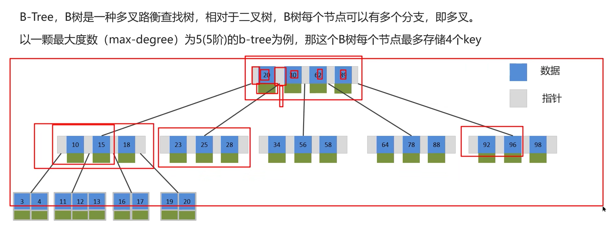
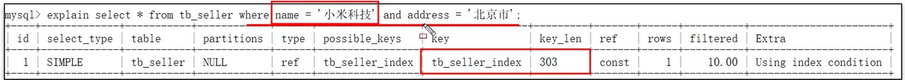
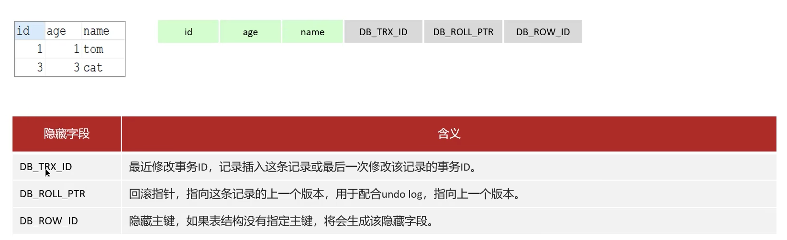
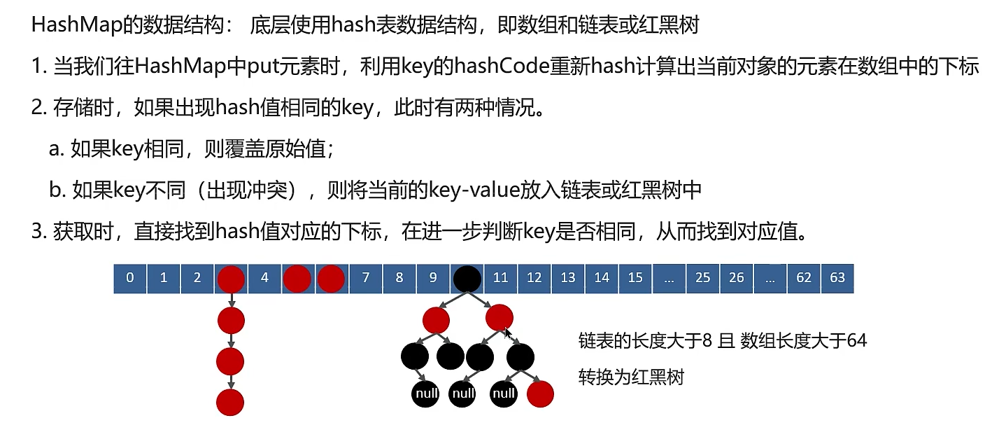

# Java八股

## MySQL


### 定位慢查询

> 执行时间比较久的SQL查询

+ 出现情况
  1. 聚合查询
  2. 多表查询
  3. 表数据量过大查询
  4. 深度分页查询
+ 表象：页面加载过慢，接口压测响应时间过长（超过1s）

***

**定位慢查询的方式：**

1. 方案一：开源工具
   + 调试工具：Arthas
   + 运维工具：Prometheus，Skywalking
2. 方案二：MySQL自带慢日志
   + 慢查询日志记录了所有执行时间超过指定参数（long_query_time，单位：秒，默认10秒）的所有SQL语句的日志。如果开启慢查询日志，需要在MySQL的配置文件my.conf中配置如下信息：
   + 

### 分析SQL语句

+ 慢sql种类

+ 分析SQL：

  + 可以采用EXPLAIN或者DESC命令获取MySQL如何执行SELECT语句的信息

  + 

  + 

  + type：这条sql的连接类型，性能由好到差从上向下
    + NULL：略
    + system：查询系统中的表
    + const：根据主键查询
    + eq_ref：主键索引查询或唯一索引查询，一般返回一条数据
    + ref：索引查询，可能返回多条数据，比如根据地域查询
    + range：范围查询
    + index（**需要优化**）：全索引查询，扫描索引树
    + all（**需要优化**）：无索引，全盘扫描
  + 

### 索引及其优化

> 索引（index）是帮助 MySQL **高效获取数据**的数据结构（有序）。在数据之外，数据库系统还维护着满足特定查找算法的**数据结构（B+树）**，这些数据结构以某种方式**引用（指向）数据**，这样就可以在这些数据结构上实现高级查找算法，这种数据结构就是索引。

#### 数据结构对比

+ 二叉搜索树
  + 
  + 时间不稳定
  
+ 红黑树
  + 
  
  + > 红黑树是一种**<u>自平衡</u>**的二叉搜索树。每个节点额外存储了一个 color 字段 ("RED" or "BLACK")，用于确保树在插入和删除时保持平衡。
  
  + 如果数据量巨大的，时间复杂度依旧很高
  
  + 
  
+ B树
  + 
  
+ B+树
  + 
  + 非叶子节点不存储数据，哪怕是分支节点上的key也会出现在叶子节点上。
  + 叶子节点之间会连成双向链表
  
+ B树与B+树对比：
  + 磁盘读写代价B+树更低：B树需要将分支节点上的data也读入，B+树分支节点无data查询效率更高；此外B+树只需要存储key的树，没有data所以存储压力更低
  + 查询效率B+树更加稳定：因为数据全部在叶子节点，所以查找路径长度差不多
  + B+树便于扫库和区间查询：叶子节点连成双向链表，只要找到了其中一个节点就可以通过链表进行区间查询
  
+ 

#### 聚集索引与非聚集索引


+ 
+ 举例：
  + 数据表
  + 聚簇索引：叶子节点存储整行记录
  + 二级索引：对name建立索引，叶子节点存储主键值，key都是name
+ 回表查询
  + select * from table where name="Lee"
  + 通过二级索引的key来查询某一条数据，于是先通过二级索引找到主键值。再通过主键值在聚集索引找到行

#### 覆盖索引

> 覆盖索引是指查询使用了索引，并且需要返回的列在该索引中已经全部能找到

+ 以上图举例：
  + select id，name from table where name="Lee"
  + select * from table where id=1
  + 只要是按照索引（不论是聚集还是非聚集）查的，并且不需要回表查就都算是覆盖索引
+ 超大分页处理
  + 
  + 

#### 索引创建原则

+ 索引种类：
  + 主键索引
  + 唯一索引
  + 普通索引：根据业务创建的索引
+ 普通索引创建原则：
  1. **（重要）**针对数据量较大，且查询比较频繁的表建立索引。单表超过10w数据（增加用户体验）。
  2. **（重要）**针对常作为查询条件（where）,排序（order by），分组（group by）操作的字段建立索引。
  3. 尽量选择区分度高的列作为索引，尽量建立唯一索引，区分度越高，使用索引的效率越高
  4. 如果是字符串类型的字段，字段的长度较长，可以针对于字段的特点，建立前缀索引。
  5. **（重要）**尽量使用联合索引，将减少单列索引，查询时，联合索引很多时候可以覆盖索引，节省存储空间，避免回表，提高查询效率。
     + 联合索引的结构：
  6. **（重要）**要控制索引的数量，索引并不是多多益善，索引越多，维护索引结构的代价也就越大，会影响删改的效率。
  7. 如果索引列不能存储NULL，在创建表时使用NOT NULL约束它。当优化器知道每列是否包含NULL值，它可以更好地确定哪个索引最有效地用于查询

#### 索引失效

+ 出现失效的情况
  1. 违反最左前缀法则（如图，索引顺序为：name,status,address)
     + 如果索引了多列，要遵守最左前缀法则——指的是查询从索引的最左前列开始，并且不跳过索引中的列。
     + 索引生效，符合最左前缀法则
     + 索引失效，违法最左前缀法则，key和key_len=NULL
     + 如果符合最左前缀，跳过中间的某一列，则只有左边满足法则的列生效，即只有name生效
  2. 某一索引范围查询，则会导致右边的索引失效
     + name和status走的索引，address没有
  3. 不要在索引列上进行运算操作，该索引及其右边索引也会失效
     + 
  4. 字符串不加单引号，造成该索引及其右边索引失效。
     + 类型转换导致失效
  5. 以%开头的Like模糊查询，索引失效。如果仅仅是尾部模糊匹配，索引不会失效。如果是头部则会失效。
     + 

### SQL优化


+ 表的设计优化（参考案例开发手册《嵩山版》）
  1. 比如设置合适的数值（tinyint int bigint)，要跟顾实际情况选择
  2. 比如设置合适的字符串类型（char,varchar）char定长效率高，varchar可变长度效率稍低
+ SQL语句优化
  1. SELECT 语句务必指明字段名称（避免直接使用 `select *`），有可能使用到覆盖索引。
  2. SQL 语句要避免造成索引失效的写法。
  3. 尽量用 `union all` 代替 `union`，`union` 会多一次过滤，效率低。
     + 
     + union all会把所有数据都展示，存在重复。union则会做一次重复过滤
  4. 避免在 `where` 子句中对字段进行表达式操作。
  5. Join 优化：能用 `inner join` 就不用 `left join` 或 `right join`。如必须使用，一定要以小表为驱动，内连接会对两个表进行优化，优先把小表放到外边，把大表放到里边。`left join` 或 `right join` 不会重新调整顺序。
     + 
     + 3在外层，1000在里层
+ 主从复制和读写分离
  + 

### 事务

#### 事务特性

+ 

#### 并发

+ 并发事务问题
+ 
+ 解决方案：事务隔离级别
+ 

#### undo log和redo log

- > **缓冲池（buffer pool）** ：主内存中的一个区域，里面可以缓存磁盘上经常操作的真实数据。在执行增删改查操作时，先操作缓冲池中的数据（若缓冲池没有数据，则从磁盘加载并缓存），以一定频率刷新到磁盘，从而减少磁盘 I/O，加快处理速度。
  >
  > **数据页（page）** ：是 InnoDB 存储引擎磁盘管理的最小单元，每个页的大小默认为 16KB。页中存储的是行数据。

- 

**redo log**

- 背景：如果内存写完的页还没有同步到磁盘，服务器宕机
- 重做日志，记录的是事务提交时数据页的物理修改，用来实现事务的**持久性**。
- 组成：
  - 重做日志缓冲（redo log buffer），存储在内存中
  - 重做日志文件（redo log file），存储在磁盘中
- 当事务提交之后会把所有修改信息都存在该日志文件中，用于在刷新脏页到磁盘，发送错误时，进行数据恢复使用。
- 自我理解：Buffer Pool写入数据后到了一定时间会进行持久化，在写的过程中Redolog buffer也会往Redolog file写，这个过程叫做刷盘。InnoDB在将缓冲池数据写入内存中的过程中会有一个双写缓冲区机制来防止“部分写”问题。（这里可以直接理解为如果将缓冲池进行持久化过程中发生宕机，我们至少可以获得进行写入磁盘之前的未被写过的数据）。
  - 如果发生宕机我们可以通过读取redolog file来恢复redolog buffer。
  - 我们将磁盘初始状态数据读取出来，然后按照redolog file来重新执行操作。
  - 最后就可以恢复数据，然后再开始写入磁盘

**undo log**

+ 回滚日志，用于记录数据被修改前的信息，作用包含两个：提供<u>回滚</u>和<u>MVCC（多版本并发控制）</u>。undo log相比redo log记录物理日志不同，它是记录<u>逻辑日志</u>。
  + 可以认为当delete一条记录时，undo log会记录一条对应的insert记录，反正亦然。
  + 当update一条记录时，他记录一条对应相反的update记录。当执行rollback时，就可以从undo log中的逻辑记录读取到相应的内容并进行回滚。
+ undo log用来实现事务的一致性和原子性


**两者对比**

+ redo log：记录的是数据页的物理变化，服务宕机可用来同步数据
+ undo log：记录的是逻辑日志，当事务回滚是，通过逆操作恢复原来的数据
+ redo log保证了事物的**<u>持久性</u>**，undo log保证了事物的**<u>原子性和一致性</u>**
+ redo log用于已经commit之后，持久化过程中。undo log用于在commit之前。


### MVCC

> 实现**<u>隔离性</u>**：
>
> + 锁：排他锁（如一个事务获得了一个数据行的排他锁，其他事务就不能再获取该行其他锁）
> + mvcc：多版本并发控制
>
> 全称**M**ulti-**V**ersion **C**oncurrency **C**ontrol，多版本并发控制。只维护一个数据的多个版本，使得读写操作没有冲突。

+ MVCC的具体实现，主要依赖于数据库记录中的<u>隐式字段，undo log日志，readView</u>。
+ 隐式字段
  + 
+ undo log
  + 
  + 版本链
+ readView
  + 
  + 当前读
  + 快照读

​    


## Java集合

**Java集合框架体系**

+ 
+ 线程安全：指添加了synchronized锁，同时性能低
+ LinkedList底层是双向链表
+ ConcurrentHashMap：线程安全的实现方式不一样

### List相关

+ 数据结构-数组

  + 
  + 

+ **ArrayList源码分析**

  + 成员变量：

    ```java
        private static final long serialVersionUID = 8683452581122892189L;
    
        private static final int DEFAULT_CAPACITY = 10;
    //初始容量
        private static final Object[] EMPTY_ELEMENTDATA = {};
        private static final Object[] DEFAULTCAPACITY_EMPTY_ELEMENTDATA = {};
        transient Object[] elementData;
        private int size;
    ```
    
  + 有参，无参，对象拷贝构造函数
  
    ```java
        public ArrayList(int initialCapacity) {
            if (initialCapacity > 0) {
                this.elementData = new Object[initialCapacity];
            } else if (initialCapacity == 0) {
                this.elementData = EMPTY_ELEMENTDATA;
            } else {
                throw new IllegalArgumentException("Illegal Capacity: "+
                                                   initialCapacity);
            }
        }
        
        public ArrayList() {
            this.elementData = DEFAULTCAPACITY_EMPTY_ELEMENTDATA;
            //默认容量 但是是空集合
        }
    
    	
    	public ArrayList(Collection<? extends E> c) {
            Object[] a = c.toArray();
            if ((size = a.length) != 0) {
                if (c.getClass() == ArrayList.class) {
                    elementData = a;
                } else {
                    elementData = Arrays.copyOf(a, size, Object[].class);
                }
            } else {
                // replace with empty array.
                elementData = EMPTY_ELEMENTDATA;
            }
        }
    //将collection队列转化为数组，然后将数组的地址赋给elementData
    	
    ```
  
  + 添加和扩容操作
  
+ ArrayList相关面试题

  + 底层用动态的数组实现
  + 初始容量为0，默认容量为10。但是要在第一次添加数据的时候，空数组才会被设置为默认容量
  + 每次扩容是扩容到1.5倍，每次扩容需要拷贝数组
  + 添加数据流程：
    1. 用size记录逻辑容量，然后size+1;
    2. 根据size计算至少需要分配的容量，如果是无参构造，那么就最少是10
    3. 更具最少需要分配的容量判断物理容量是否满足要求，不满足则用grow做扩容
    4. 每次扩容物理容量的1.5倍，如果还不够（比如实际物理容量是0，扩容还是0），则直接将要求的最小容量设置为物理容量。用Arrays.copuOf（）做迁移
  + ArrayList list=new ArrayList(10)中的list需要扩容几次？制定了具体容量，则不做扩容

+ 数组和List之间的转换

  + 数组转List。

    ```java
    String[] strs={"aaa","bbb","ccc"};
    List<String> list=Arrays.asList(strs);
    ```

  + 当修改strs的时候，list也会受影响。原因是asList方法本质上是添加了一个指针做引用。不过要注意此时list的实现并非是之前使用的ArrayList，而是Arrays里面的一个内部类。所以实现方式和我们之前使用的ArrayList不一样。

  + List转数组

    ```java
    String[] arr=list.toArray(new String[list.size]);
    ```

+ ArrayList和LinkedList之间的区别是什么？

  + 
  + 


### HashMap相关

+ 数据结构：红黑树，二叉树，散列表
  + 
  + 在添加或删除节点的时候，如果不符合这些性质会发生旋转，以达到所有的性质
  + 查找，添加，删除时间复杂度都是O(log n)
+ 实现原理
  + 
  + 
+ put方法的流程
  + 
  + 
  + 第一次添加数据
  + 


​    